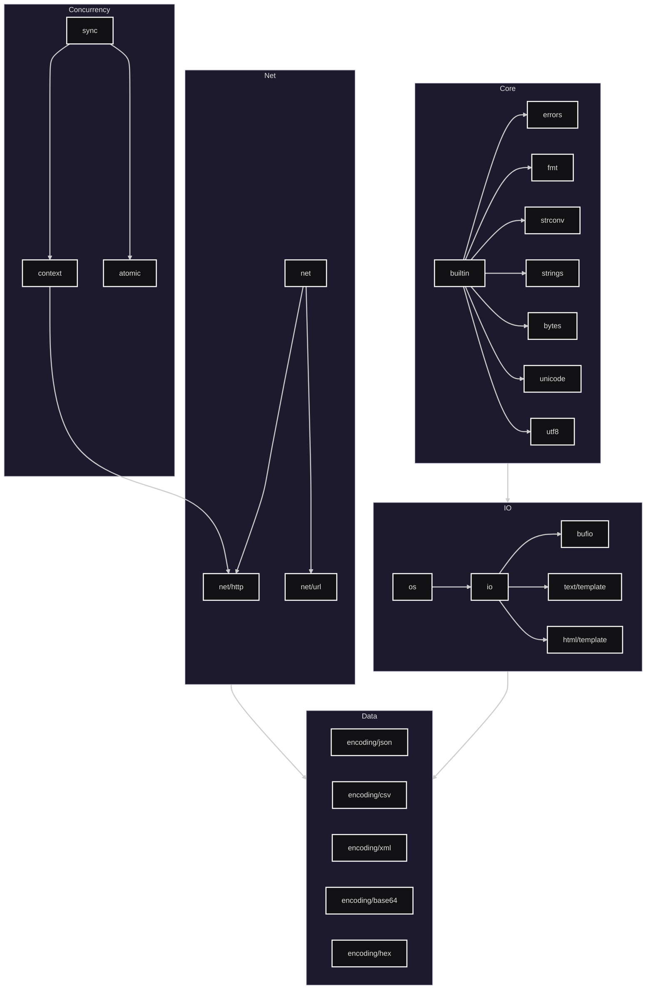

# 🧠 Go Programming

This repository demonstrates core **data structures** and **algorithms** implemented in **Go (Golang)** — with a focus on performance, clarity, and idiomatic code.

---

## 📚 Contents

| Feature | Description |
|--------|-------------|
| `tree/` | Binary trees, insertion, traversal, TreeSort |
| `sort/` | Implementations of Merge Sort, Quick Sort, Bubble Sort |
| `structures/` | Stacks, Queues, Linked Lists, and Circular Buffers |
| `utils/` | Helper functions, benchmarking tools |
| `web/`  | Handlers, Route-mapping, HTML/TEXT Templates
| `network/`  | TCP/UDP, Web Socket Programming, UNIX, Transports, Clients
| `data/` | Marshalling data, pointers, *DB type, Handlers

---

## 🚀 Example: TreeSort

```go
values := []int{5, 1, 9, 2, 6}
TreeSort(values)
fmt.Println("Sorted:", values)
```



